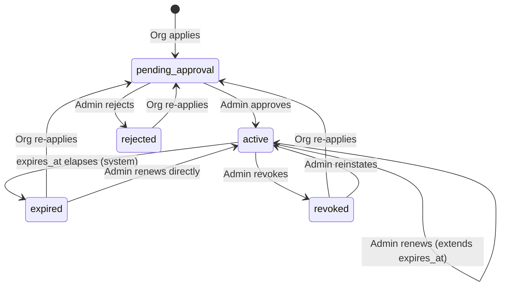
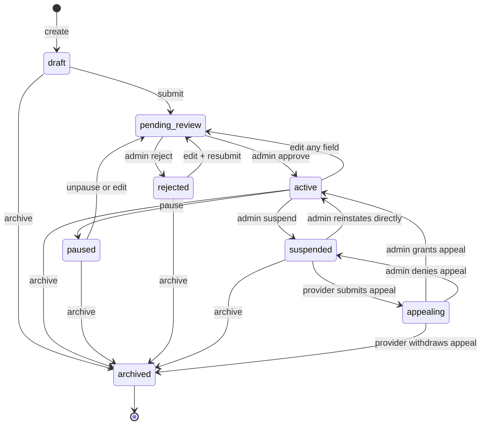

# Vetchium Marketplace — Functional Requirements

Status: DRAFT
Authors: @psankar
Dependencies: Org accounts, OrgUser accounts, Verified Domains

---

## Overview

The Vetchium Marketplace is where Employer Organisations ("Orgs") can list professional services
they offer to other Orgs. It is the connective tissue between service providers and buyers inside
the Vetchium ecosystem.

The first — and for now only — service category is **Talent Sourcing**: a provider Org recruits
talent on behalf of a buyer Org. This is a pure B2B interaction. HubUsers are not consumers of
any current service category; future categories (e.g. "Resume Review") may extend marketplace
access to HubUsers.

The Marketplace is not a transactional platform. Vetchium does not handle payments between
provider and buyer, does not manage contracts or communications between them, and does not take
a percentage of any deal. It connects providers with buyers; the provider supplies a contact URL
and all follow-up happens off-platform.

An Org may simultaneously be a **provider** (owns ServiceListings) and a **buyer** (browses other
Orgs' ServiceListings). These two positions are not mutually exclusive. An Org cannot consume its own
ServiceListing: endpoints that expose ServiceListing detail to buyers return HTTP 403 if the
caller belongs to the provider Org.

---

## Core Distinctions: Roles and Capabilities

**Role** — a permission granted to a _user account_ (OrgUser, HubUser, AdminUser) to perform
specific actions. Example: `org:manage_marketplace` on an OrgUser means "this user may manage
this Org's ServiceListings."

**Capability** — an entitlement granted to an _Org_ (not a user) that determines whether the
Org is eligible for a platform feature at all. Example: the `marketplace_provider` capability
means "this Org is licensed to offer services on the marketplace." Capabilities are tied to a
paid subscription.

Both conditions must be true for an OrgUser to manage ServiceListings:

1. The Org holds an **active** `marketplace_provider` capability.
2. The OrgUser holds the `org:manage_marketplace` **role**.

An Org without the capability returns HTTP 403 on any ServiceListing write endpoint, regardless of the
OrgUser's roles. An OrgUser without the role returns HTTP 403 regardless of the Org's capability.

---

## Marketplace Provider Capability

### Pricing

Access to the marketplace as a provider is a paid Org capability. Vetchium charges a **fixed
subscription fee per Org** for the `marketplace_provider` capability — not per ServiceListing and not
as a percentage of any deal. The subscription covers all of that Org's ServiceListings (up to
the quota) for the billing period.

During the initial period, Vetchium may grant the capability at a discounted price (including
zero). The process does not change regardless of the price: every capability record has an
explicit price, currency, and subscription period. Early partners simply receive an approval with
`subscription_price = 0`.

Payment collection happens outside this spec (off-platform or via a payment provider integration
handled separately). The marketplace spec is only concerned with recording who applied, who
approved, the agreed price, and when the capability expires.

### Capability Storage

Capabilities are stored in the `org_capabilities` table in the Org's **regional DB**:

| Column               | Notes                                                           |
| -------------------- | --------------------------------------------------------------- |
| `org_id`             | References the Org                                              |
| `capability`         | `marketplace_provider` for this feature                         |
| `status`             | See state machine below                                         |
| `application_note`   | Org's note when applying; optional, max 1,000 chars             |
| `applied_at`         | When the Org most recently submitted an application             |
| `admin_id`           | Admin who last acted on this record                             |
| `admin_note`         | Admin's note; shown to the Org on rejection and revocation      |
| `subscription_price` | Set on approval; may be zero                                    |
| `currency`           | ISO 4217 code (e.g. `INR`, `USD`); set on approval              |
| `granted_at`         | Timestamp when the capability most recently became `active`     |
| `expires_at`         | Subscription period end; set on approval and updated on renewal |

`UNIQUE (org_id, capability)` — one row per Org per capability type. Re-applying updates the
existing row rather than inserting a new one; full history is preserved in audit logs.

### Capability State Machine



| Status             | Visible to Org | Description                                                         |
| ------------------ | -------------- | ------------------------------------------------------------------- |
| `pending_approval` | Yes            | Org has applied; awaiting admin decision                            |
| `active`           | Yes            | Capability is live; ServiceListings are discoverable                |
| `rejected`         | Yes            | Admin denied the application; Org can re-apply                      |
| `expired`          | Yes            | Subscription period ended; ServiceListings are hidden until renewed |
| `revoked`          | Yes            | Admin revoked access; ServiceListings are hidden                    |

### Capability Transition Table

| From               | Action                                                      | To                 | Actor                              |
| ------------------ | ----------------------------------------------------------- | ------------------ | ---------------------------------- |
| _(none)_           | Org applies                                                 | `pending_approval` | OrgUser (`org:manage_marketplace`) |
| `pending_approval` | Admin approves (sets price, currency, period)               | `active`           | Admin                              |
| `pending_approval` | Admin rejects (with reason)                                 | `rejected`         | Admin                              |
| `rejected`         | Org re-applies                                              | `pending_approval` | OrgUser (`org:manage_marketplace`) |
| `active`           | Admin renews (extends expires_at, optionally updates price) | `active`           | Admin                              |
| `active`           | `expires_at` elapses                                        | `expired`          | System                             |
| `active`           | Admin revokes (with reason)                                 | `revoked`          | Admin                              |
| `expired`          | Org re-applies                                              | `pending_approval` | OrgUser (`org:manage_marketplace`) |
| `expired`          | Admin renews directly (without requiring re-application)    | `active`           | Admin                              |
| `revoked`          | Org re-applies                                              | `pending_approval` | OrgUser (`org:manage_marketplace`) |
| `revoked`          | Admin reinstates                                            | `active`           | Admin                              |

### Key Rules for Capabilities

- **One record per Org**: There is at most one `org_capabilities` row per Org per capability
  type at any time. Re-applying overwrites the existing row's status and `applied_at`.
- **ServiceListing state is unaffected by capability changes**: When a capability expires or is revoked,
  no ServiceListing state changes in the DB. The browse queries join on `org_capabilities` and exclude
  Orgs whose capability is not `active`. Renewal restores discoverability instantly.
- **Draft creation is gated**: An OrgUser cannot create a new ServiceListing draft while the
  Org's capability is not `active`. Preparing drafts before the capability is granted is not
  supported.
- **Pending ServiceListings remain in admin queue**: A `pending_review` ServiceListing from an Org whose
  capability lapses remains in the admin queue. It is not auto-rejected.
- **Renewal is admin-initiated**: Subscription renewal is performed by the admin (extending
  `expires_at`). The Org does not submit a renewal application; they re-apply only if the
  capability has expired and the admin has not renewed it.

---

## Acceptance Criteria

- **In-platform provider application**: An OrgUser with `org:manage_marketplace` can apply for
  the `marketplace_provider` capability from within the Org portal. The application is reviewed
  by a Vetchium admin.
- **Capability-gated ServiceListing writes**: Any ServiceListing write action returns HTTP 403 if the Org's
  capability is not `active`.
- **ServiceListing Creation**: An OrgUser with the `org:manage_marketplace` role, at an Org with
  an active `marketplace_provider` capability, can create, edit, and delete that Org's ServiceListings.
- **ServiceListing Management**: ServiceListings move through a defined state machine (see below).
- **Review Workflow**: An admin with `admin:manage_marketplace` (or `admin:superadmin`) can
  approve, reject, suspend, or reinstate ServiceListings.
- **Appeal Workflow**: A suspended provider can submit a formal in-platform appeal; the admin
  grants or denies it. One appeal per suspension.
- **Self-consumption blocked**: `get-public-marketplace-service-listing` and browse detail return
  HTTP 403 if the caller's Org is the provider Org.
- **Discovery**: Any authenticated OrgUser can browse `active` ServiceListings from Orgs with an
  active capability.
- **Discovery (Global)**: ServiceListings from any region are discoverable by any buyer.
- **Search & Filtering**: Keyword search and structured filters (Industry, Job Function, etc.).
- **Trust & Safety**: Any authenticated OrgUser (who is not the provider) can report a
  ServiceListing for abuse review.
- **Audit Logging**: Provider and system events → regional `audit_logs`; admin actions →
  Global DB `admin_audit_logs`.
- **Access Control Enforcement**: OrgUser actions are gated by role (`org:manage_marketplace`); Org-level provider access is gated by the `marketplace_provider` capability. These are enforced independently.

---

## Actors

| Actor              | Description                                                                                                                                                              |
| ------------------ | ------------------------------------------------------------------------------------------------------------------------------------------------------------------------ |
| **Provider Org**   | An Org with an active `marketplace_provider` capability that creates and manages ServiceListings                                                                         |
| **Buyer Org**      | An OrgUser at a different Org who browses ServiceListings and contacts the provider                                                                                      |
| **Vetchium Admin** | Reviews capability applications; grants, rejects, renews, and revokes capabilities; reviews ServiceListings (approve, reject, suspend, reinstate, grant or deny appeals) |
| **System**         | Background worker that marks capabilities as `expired` when `expires_at` elapses                                                                                         |

---

## ServiceListing

A ServiceListing is created by a Provider Org to advertise a specific service it offers. Each
ServiceListing belongs to exactly one **service category** (e.g. `talent_sourcing`). A Provider
Org may have any number of active ServiceListings, including multiple in the same category.

Each ServiceListing is identified by a UUID generated at creation time.

### ServiceListing States



| State            | Who can see it                                                              | Description                                          |
| ---------------- | --------------------------------------------------------------------------- | ---------------------------------------------------- |
| `draft`          | Provider Org only                                                           | Created but not yet submitted for review             |
| `pending_review` | Provider Org + Vetchium Admin                                               | Submitted; awaiting admin approval                   |
| `active`         | All authenticated OrgUsers from other Orgs (while Org capability is active) | Live in the marketplace                              |
| `paused`         | Provider Org only                                                           | Temporarily hidden by the provider; not discoverable |
| `rejected`       | Provider Org + Vetchium Admin                                               | Admin rejected; provider can edit and resubmit       |
| `suspended`      | Provider Org + Vetchium Admin                                               | Removed from public view by admin                    |
| `appealing`      | Provider Org + Vetchium Admin                                               | Provider has filed a formal appeal                   |
| `archived`       | Provider Org only                                                           | Permanently removed from the marketplace             |

### Complete Transition Table

| From state       | Action                                     | To state         | Actor    |
| ---------------- | ------------------------------------------ | ---------------- | -------- |
| `draft`          | Edit any field                             | `draft`          | Provider |
| `draft`          | Submit for review                          | `pending_review` | Provider |
| `draft`          | Archive                                    | `archived`       | Provider |
| `pending_review` | Approve                                    | `active`         | Admin    |
| `pending_review` | Reject                                     | `rejected`       | Admin    |
| `active`         | Edit any field                             | `pending_review` | Provider |
| `active`         | Pause                                      | `paused`         | Provider |
| `active`         | Archive                                    | `archived`       | Provider |
| `active`         | Suspend                                    | `suspended`      | Admin    |
| `paused`         | Unpause (with or without prior edits)      | `pending_review` | Provider |
| `paused`         | Edit any field                             | `pending_review` | Provider |
| `paused`         | Archive                                    | `archived`       | Provider |
| `rejected`       | Edit any field + resubmit                  | `pending_review` | Provider |
| `rejected`       | Archive                                    | `archived`       | Provider |
| `suspended`      | Submit appeal (if not appeal_exhausted)    | `appealing`      | Provider |
| `suspended`      | Reinstate (admin-initiated, no appeal)     | `active`         | Admin    |
| `suspended`      | Archive                                    | `archived`       | Provider |
| `appealing`      | Grant appeal                               | `active`         | Admin    |
| `appealing`      | Deny appeal (sets appeal_exhausted = true) | `suspended`      | Admin    |
| `appealing`      | Archive (withdraws appeal)                 | `archived`       | Provider |

### Key Rules

- **Capability gate on writes**: Any ServiceListing write action returns HTTP 403 if the Org's
  `marketplace_provider` capability is not `active`, regardless of the OrgUser's role.
- **All edits are disruptive**: Any field change on an `active` ServiceListing immediately moves
  it to `pending_review` and hides it from buyers. The same applies to `paused` ServiceListings.
  There is no distinction between minor and major edits.
- **Unpause always requires re-review**: Unpausing a ServiceListing always moves it to
  `pending_review`, regardless of whether edits were made while paused.
- **Editing while paused**: Saving edits to a `paused` ServiceListing immediately moves it to
  `pending_review`. No separate "submit" step is needed.
- **Reinstate skips re-review**: When an admin directly reinstates a `suspended` ServiceListing,
  it goes to `active` immediately. The ServiceListing was already approved before suspension.
- **Editing `pending_review`, `suspended`, or `appealing` is not allowed**: The provider must
  wait for the outcome.
- **`rejected` → `pending_review`**: At least one field must change before resubmit is available.
- **One appeal per suspension**: After a denial, `appeal_exhausted` is set to `true`. Attempting
  another appeal returns HTTP 422. The flag resets to `false` when an admin reinstates the
  ServiceListing (via grant-appeal or direct reinstate).
- **Archiving withdraws a pending appeal**: Archiving from `appealing` state is treated as
  withdrawing the appeal; no admin action is needed.
- **Self-consumption blocked**: `get-public-marketplace-service-listing` returns HTTP 403 if the
  caller's Org is the provider Org.
- **Providers cannot report their own ServiceListings**: HTTP 403 if the caller belongs to the
  provider Org.

---

## ServiceListing Fields

### Common to All Service Categories

| Field                | Required | Notes                                                   |
| -------------------- | -------- | ------------------------------------------------------- |
| Name                 | Yes      | Max 100 characters                                      |
| Short blurb          | Yes      | Max 250 characters; shown in browse results             |
| Description          | Yes      | Full details; free-form rich text; max 5,000 characters |
| Countries of service | Yes      | One or more ISO 3166-1 alpha-2 country codes            |
| Contact URL          | Yes      | Must start with `https://`                              |
| Pricing information  | No       | Free-form text; max 500 characters                      |
| Service category     | Yes      | Fixed enum; currently only `talent_sourcing`            |

The Org's own logo (set on the Org account) is used as the ServiceListing logo in browse results.

### Talent Sourcing — Specific Fields

| Field                       | Required | Notes                                                                           |
| --------------------------- | -------- | ------------------------------------------------------------------------------- |
| Industries served           | Yes      | One or more values from the Industry enum; at least one required                |
| Industries served (other)   | No       | Free-form text, max 100 chars; required when `other` is selected                |
| Company sizes served        | Yes      | One or more: `startup` (1–50), `smb` (51–500), `enterprise` (500+)              |
| Job functions sourced       | Yes      | One or more values from the Job Function enum                                   |
| Seniority levels sourced    | Yes      | One or more: `intern`, `junior`, `mid`, `senior`, `lead`, `director`, `c_suite` |
| Geographic sourcing regions | Yes      | One or more ISO 3166-1 alpha-2 country codes                                    |

### Industry Enum

| Value                              | Display label                      |
| ---------------------------------- | ---------------------------------- |
| `technology_software`              | Technology & Software              |
| `finance_banking`                  | Finance & Banking                  |
| `healthcare_life_sciences`         | Healthcare & Life Sciences         |
| `manufacturing_engineering`        | Manufacturing & Engineering        |
| `retail_consumer_goods`            | Retail & Consumer Goods            |
| `media_entertainment`              | Media & Entertainment              |
| `education_training`               | Education & Training               |
| `legal_services`                   | Legal Services                     |
| `consulting_professional_services` | Consulting & Professional Services |
| `real_estate_construction`         | Real Estate & Construction         |
| `energy_utilities`                 | Energy & Utilities                 |
| `logistics_supply_chain`           | Logistics & Supply Chain           |
| `government_public_sector`         | Government & Public Sector         |
| `nonprofit_ngo`                    | Non-profit & NGO                   |
| `other`                            | Other (specify below)              |

When `other` is selected, the `industries_served_other` free-text field (max 100 chars) is required.

### Job Function Enum

| Value                          | Display label                  |
| ------------------------------ | ------------------------------ |
| `engineering_technology`       | Engineering & Technology       |
| `sales_business_development`   | Sales & Business Development   |
| `marketing`                    | Marketing                      |
| `finance_accounting`           | Finance & Accounting           |
| `human_resources`              | Human Resources                |
| `operations_supply_chain`      | Operations & Supply Chain      |
| `product_management`           | Product Management             |
| `design_creative`              | Design & Creative              |
| `legal_compliance`             | Legal & Compliance             |
| `customer_success_support`     | Customer Success & Support     |
| `data_analytics`               | Data & Analytics               |
| `executive_general_management` | Executive & General Management |

---

## Data Residency & Discovery

### Primary storage

Every ServiceListing is stored in the **regional DB of the provider's home region**. The
`org_capabilities` table is also stored in the provider's regional DB.

The following are stored in the provider's regional DB on the ServiceListing row:

- All content fields (name, blurb, description, taxonomy, contact URL)
- State machine fields (`state`, `last_activated_at`, `appeal_exhausted`)
- Review metadata (`last_review_admin_id`, `last_review_admin_note`,
  `last_review_verification_id`, `last_reviewed_at`) — overwritten on each admin action; full
  history preserved in audit logs
- Appeal metadata (`appeal_reason`, `appeal_submitted_at`, `appeal_admin_note`,
  `appeal_decided_at`) — overwritten on each suspension cycle; full history preserved in audit logs
- Reports (`marketplace_service_listing_reports`)

### Discovery via federation

ServiceListings are discoverable globally through **federated queries**. When a buyer calls
`POST /org/browse-marketplace-service-listings`, the API server fans out the query **in parallel**
to all regional DB pools, applies the same filters on each (including the `org_capabilities`
join to exclude inactive providers), and merges results in memory before returning a single
sorted page. Adding a new region automatically includes its ServiceListings with no migration
required.

### Routing detail fetches

Browse results include a `home_region` field on each ServiceListing summary. When a buyer calls
`POST /org/get-public-marketplace-service-listing`, the API server uses `home_region` to route
the query directly to the correct regional DB. Admin actions similarly use `home_region` to
route writes.

### Pagination across regions

The pagination cursor is a **composite keyset cursor**: an opaque, base64-encoded map encoding
the position within each regional stream:

```
{ "ind1": { "created_at": "…", "service_listing_id": "…" },
  "usa1": { "created_at": "…", "service_listing_id": "…" },
  "deu1": { "created_at": "…", "service_listing_id": "…" } }
```

Each regional DB receives a `WHERE (created_at, service_listing_id) < (cursor.created_at,
cursor.service_listing_id)` clause for its own cursor position. The API layer performs an
in-memory merge sort and advances each region's cursor to the last included item.

### Soft deletes

Archived ServiceListings are retained indefinitely with `state = archived`. They are never
hard-deleted, for audit and compliance purposes.

---

## Provider Org: Lifecycle & Workflow

### Becoming a Provider (in-platform flow)

The full journey from wanting to be a provider to having live ServiceListings:

1. **OrgUser discovers the Marketplace section** in the Org portal. An OrgUser with the
   `org:manage_marketplace` role sees a "Marketplace Provider" section on the dashboard.
   If the Org has no capability record, the section shows an explanation of the Marketplace
   and an "Apply to become a provider" call to action.

2. **OrgUser submits an application** (`POST /org/apply-marketplace-provider-capability`).
   They may include an optional note (max 1,000 chars) describing the services they intend
   to offer. The Org's capability record is created with `status = pending_approval`. The Org
   portal shows "Your application is under review."

3. **Admin reviews the application** in the admin portal. The admin sees the Org's name,
   verified domains, application note, and account history.
   - **Approve**: Admin sets `subscription_price`, `currency`, and `subscription_period_days`
     (e.g. 365 for annual). Capability moves to `active`. OrgUsers with `org:manage_marketplace`
     can now create ServiceListings.
   - **Reject**: Admin provides a reason visible to the Org. Capability moves to `rejected`.
     The Org may edit their application note and re-apply.

4. **OrgUser creates ServiceListings** (once capability is `active`). See Creating & Editing
   below.

5. **Admin reviews each ServiceListing** submitted for review. On approval, the ServiceListing goes
   `active` and is discoverable by buyers.

6. **Subscription renewal**: Before or after `expires_at`, the admin renews the capability
   (extending `expires_at` and optionally updating the price) via the admin portal. No
   re-application is required from the Org for routine renewal. If the capability lapses and
   the admin has not renewed it, the Org can re-apply.

### Creating & Editing

- An OrgUser with `org:manage_marketplace` and an active capability creates a ServiceListing
  in `draft` state.
- The provider edits a `draft` ServiceListing freely; it remains `draft`.
- Submitting a `draft` (or `rejected`) ServiceListing moves it to `pending_review`.
- **All edits are disruptive**: Saving any field change on an `active` or `paused` ServiceListing
  immediately moves it to `pending_review` and hides it from buyers.
- **i18n**: One language per ServiceListing. If a provider wants to offer a service in English
  and Tamil, they create two separate ServiceListings. There is no uniqueness constraint on
  ServiceListing names within an Org.

### Pausing & Unpausing

- A provider may pause an `active` ServiceListing; it moves to `paused` and disappears from
  the marketplace.
- Unpausing always sends the ServiceListing to `pending_review`, not directly to `active`,
  regardless of whether any edits were made while paused.

### Archiving

- A provider may archive from `active`, `paused`, `rejected`, `suspended`, or `appealing`.
- Archiving from `appealing` is treated as withdrawing the appeal; no admin action is required.
- Archiving is permanent and cannot be undone.

### Suspension Appeal

If an admin suspends a ServiceListing the provider believes was wrongly removed:

1. Provider submits a formal appeal (`POST /org/submit-marketplace-service-listing-appeal`)
   with a written reason (required, max 2,000 characters).
2. The ServiceListing moves to `appealing`.
3. Admin reviews the appeal and either:
   - **Grants** it → ServiceListing returns to `active`; `appeal_exhausted` resets to `false`.
   - **Denies** it → ServiceListing returns to `suspended`; `appeal_exhausted` set to `true`.
     No further appeals for this suspension.
4. If the admin later reinstates the ServiceListing directly, `appeal_exhausted` also resets
   to `false`.

### ServiceListing Quota

- An Org may have at most **20 non-archived ServiceListings** in total. States that count:
  `draft`, `pending_review`, `active`, `paused`, `rejected`, `suspended`, `appealing`.
- `suspended` ServiceListings count even though the provider cannot act on them (except archive);
  archiving frees the slot.
- Attempting to create a 21st non-archived ServiceListing returns HTTP 409.

---

## Admin Workflow

### Capability Management

The admin uses `POST /admin/list-marketplace-provider-capabilities` to see pending applications
and expiring or expired capabilities. Filters: `status`, `org_id`.

**Approve** (`pending_approval → active`): Admin sets `subscription_price`, `currency`, and
`subscription_period_days`. The `granted_at` timestamp is set to now; `expires_at` is set to
`now + subscription_period_days`.

**Reject** (`pending_approval → rejected`): Admin provides a reason stored as `admin_note` and
shown to the Org.

**Renew** (`active → active` or `expired → active`): Admin extends `expires_at` (from now, or
from the current `expires_at` for proactive renewal before lapse). Admin may update
`subscription_price` and `currency`. No new application is required from the Org.

**Revoke** (`active → revoked`): Admin provides a reason stored as `admin_note` and shown to
the Org. ServiceListings are immediately hidden from buyers (no state change; the join filter excludes
inactive capabilities).

**Reinstate** (`revoked → active`): Admin restores access, optionally updating the subscription
terms. No re-application required.

### ServiceListing Review

An admin with `admin:manage_marketplace` (or `admin:superadmin`) reviews submitted ServiceListings.
Each decision records:

- `admin_verification_note`: Text justification. Required for all decisions.
- `verification_id`: Reference to internal KYB processing records. Required for Approve;
  optional for Reject and Suspend.

**Approve** (`pending_review → active`): The ServiceListing goes live. `last_activated_at` is
set to now.

**Reject** (`pending_review → rejected`): The provider can see the rejection note, edit to
address the issues, and resubmit. At least one field must be changed before resubmit is available.

**Suspend** (`active → suspended`): Removes the ServiceListing from the marketplace. The admin
must supply a reason. `appeal_exhausted` is set to `false` on each new suspension.

**Reinstate directly** (`suspended → active`): The ServiceListing goes back live immediately;
no re-review required. `appeal_exhausted` resets to `false`.

**Grant Appeal** (`appealing → active`): `last_activated_at` is set to now. `appeal_exhausted`
resets to `false`.

**Deny Appeal** (`appealing → suspended`): `appeal_exhausted` is set to `true`.

### Admin Review Queue

`POST /admin/list-marketplace-service-listings` fans out to all regional DBs. Filters:

| Filter field  | Type              | Notes                                           |
| ------------- | ----------------- | ----------------------------------------------- |
| `state`       | string (optional) | Filter by any ServiceListing state              |
| `org_id`      | UUID (optional)   | Filter by provider Org                          |
| `has_reports` | bool (optional)   | `true` = only ServiceListings with open reports |

Typical workflows:

- Pending review queue: `state: "pending_review"`
- Appeal queue: `state: "appealing"`
- Reported ServiceListings: `has_reports: true`
- All ServiceListings for an Org under investigation: `org_id: "..."`

---

## Trust & Safety: Buyer Reporting

Any authenticated OrgUser who is **not** a member of the provider Org may report a ServiceListing.

- **Endpoint**: `POST /org/report-marketplace-service-listing`
- **Rate limit**: One report per OrgUser per ServiceListing. Duplicates return HTTP 409.
- **Provider self-report**: HTTP 403 if the caller belongs to the provider Org.
- Reports are stored in `marketplace_service_listing_reports` in the provider's regional DB.
- A report does **not** auto-suspend a ServiceListing. The admin reviews flagged ServiceListings via
  the `has_reports` filter.
- Providers are **not** notified that their ServiceListing has been reported.

### Report Reason Enum

| Value                    | Display label          |
| ------------------------ | ---------------------- |
| `misleading_information` | Misleading information |
| `fraudulent`             | Fraudulent or scam     |
| `inappropriate_content`  | Inappropriate content  |
| `spam`                   | Spam or duplicate      |
| `other`                  | Other (specify below)  |

When `other` is selected, a free-text field (max 500 chars) is required.

---

## Search & Browse API

### Browse Endpoint

`POST /org/browse-marketplace-service-listings` — accessible to any authenticated OrgUser; no
specific role required. Only returns `active` ServiceListings from Orgs with an active
`marketplace_provider` capability.

`POST /org/get-public-marketplace-service-listing` returns HTTP 404 when the ServiceListing is
not `active`, and HTTP 403 when the caller's Org is the provider Org.

#### Request Filters

| Filter field                  | Type                | Notes                                                  |
| ----------------------------- | ------------------- | ------------------------------------------------------ |
| `keyword`                     | string (optional)   | Full-text search across name and short blurb           |
| `service_category`            | string (optional)   | e.g. `talent_sourcing`                                 |
| `industries`                  | string[] (optional) | Match ServiceListings serving any of the given values  |
| `company_sizes`               | string[] (optional) | `startup`, `smb`, `enterprise`                         |
| `job_functions`               | string[] (optional) | Match ServiceListings sourcing any of the given values |
| `seniority_levels`            | string[] (optional) | `intern`, `junior`, …, `c_suite`                       |
| `countries_of_service`        | string[] (optional) | ISO 3166-1 alpha-2; ServiceListings serving any match  |
| `geographic_sourcing_regions` | string[] (optional) | ISO 3166-1 alpha-2; ServiceListings sourcing any match |

All multi-value filters are OR within a field, AND across fields.

#### Pagination

Composite keyset cursor across all regions. Default page size: 20. Max: 50. Response includes
`next_cursor` (null when no more results).

#### Result Shape (ServiceListing summary)

| Field                  | Notes                                                |
| ---------------------- | ---------------------------------------------------- |
| `service_listing_id`   | UUID                                                 |
| `home_region`          | Provider's home region; used to route detail fetches |
| `name`                 | ServiceListing name                                  |
| `short_blurb`          | ServiceListing blurb                                 |
| `logo_url`             | Provider Org's logo URL                              |
| `org_name`             | Provider Org's display name                          |
| `service_category`     | e.g. `talent_sourcing`                               |
| `countries_of_service` | Array of ISO codes                                   |
| `created_at`           | ISO 8601 timestamp                                   |

Full detail (description, all taxonomy fields, contact URL, pricing info) is returned by
`POST /org/get-public-marketplace-service-listing`.

---

## UI Requirements

### Org Portal — Provider Side

**Dashboard tile**

The Org portal dashboard includes a "Marketplace" tile for OrgUsers with the
`org:manage_marketplace` role. The tile adapts based on capability status:

| Capability status                   | Tile content                                                                                                                               |
| ----------------------------------- | ------------------------------------------------------------------------------------------------------------------------------------------ |
| No record                           | Brief description of the Marketplace + "Apply to become a provider" button                                                                 |
| `pending_approval`                  | "Your application is under review." No action available.                                                                                   |
| `rejected`                          | "Your application was not approved." Admin note is shown. "Re-apply" button.                                                               |
| `active` (not near expiry)          | "Marketplace Provider — Active until [date]." "Manage ServiceListings" link.                                                               |
| `active` (within 30 days of expiry) | Same as above but with a prominent expiry warning.                                                                                         |
| `expired`                           | "Your subscription has expired. Your ServiceListings are not visible to buyers. Re-apply or contact Vetchium to renew." "Re-apply" button. |
| `revoked`                           | "Your marketplace access has been revoked. [Admin note]." "Re-apply" button if appropriate.                                                |

**Apply / Re-apply page**

- Title: "Apply to List Services on the Vetchium Marketplace"
- One optional field: `application_note` textarea (max 1,000 chars), labelled "Describe the
  services you plan to offer (optional)"
- Submit button: "Submit Application"
- On submit: show confirmation and redirect to dashboard tile showing `pending_approval` state

**ServiceListings management page**

Accessible only when capability is `active`. Shows:

- A table of all the Org's ServiceListings (all states) with state badges and last-updated date
- "Create new ServiceListing" button (disabled with tooltip if quota of 20 non-archived is reached)
- Filter by state

**Create / Edit ServiceListing form**

- All required fields clearly marked
- Service category selector (currently only `talent_sourcing`; selecting it reveals the
  talent-sourcing-specific fields)
- Country multi-select for `countries_of_service` and `geographic_sourcing_regions`
- Industry multi-select; when `other` is selected, a free-text field appears
- Seniority, job function, and company size multi-selects
- Contact URL field with `https://` prefix hint
- On save from `active` or `paused` state: warn the user before saving that this will move the
  ServiceListing to `pending_review` and make it temporarily invisible to buyers

**ServiceListing detail / status page**

Shows the current state, the last admin note (on rejection or suspension), appeal status, and
available actions (pause, archive, submit appeal) based on current state.

### Org Portal — Buyer Side

- Browse and search are accessible via the main navigation to any authenticated OrgUser,
  regardless of the Org's capability status
- Browse page: keyword search bar at the top; filter panel on the left (service category,
  industries, job functions, seniority, company size, countries); ServiceListing cards in the main area
- ServiceListing card: Org logo, ServiceListing name, short blurb, countries of service, "View details" link
- ServiceListing detail page: full description, all taxonomy fields, pricing info, contact URL as a
  prominent CTA button ("Contact Provider")
- If the caller's Org is the provider Org, the detail page returns 403; the UI should not show
  the "View details" link for the caller's own ServiceListings in browse results

### Admin Portal

**Capability applications queue** (reachable from the admin dashboard)

- Lists all capability records filterable by `status` and `org_id`
- Each row shows: Org name, capability, current status, `applied_at`, `expires_at`, `admin_note`
- Clicking a row opens the capability detail / action page

**Capability detail / action page**

Shows full capability record plus Org context (verified domains, account age, other ServiceListings).
Available actions adapt to current status:

| Status             | Available admin actions                                                  |
| ------------------ | ------------------------------------------------------------------------ |
| `pending_approval` | Approve (price + currency + period form), Reject (reason required)       |
| `active`           | Renew (extend expiry, optionally update price), Revoke (reason required) |
| `rejected`         | No action needed; Org can re-apply                                       |
| `expired`          | Renew directly (same form as renewal above)                              |
| `revoked`          | Reinstate (optionally update subscription terms)                         |

**ServiceListings review queue**

- Filterable by `state`, `org_id`, `has_reports`; default view shows `pending_review`
- Each row: Org name, ServiceListing name, service category, submitted date, report count
- Clicking a row opens the ServiceListing detail / action page

**ServiceListing detail / action page**

Shows all ServiceListing fields plus review history (from audit logs). Available actions adapt to state:

| State            | Available admin actions                                                   |
| ---------------- | ------------------------------------------------------------------------- |
| `pending_review` | Approve (verification ID required, note required), Reject (note required) |
| `active`         | Suspend (note required)                                                   |
| `suspended`      | Reinstate directly, (if `appealing`) Grant appeal, Deny appeal            |
| `appealing`      | Grant appeal, Deny appeal                                                 |
| All states       | View reports                                                              |

---

## API Endpoints

### Capability (requires `org:manage_marketplace`)

| Method | Path                                       | Description                                        |
| ------ | ------------------------------------------ | -------------------------------------------------- |
| POST   | /org/apply-marketplace-provider-capability | Submit (or re-submit) a capability application     |
| POST   | /org/get-marketplace-provider-capability   | Get the Org's current capability record and status |

### Provider (requires `org:manage_marketplace` + active `marketplace_provider` capability)

| Method | Path                                           | Description                                                              |
| ------ | ---------------------------------------------- | ------------------------------------------------------------------------ |
| POST   | /org/create-marketplace-service-listing        | Create a new ServiceListing in `draft` state                             |
| POST   | /org/update-marketplace-service-listing        | Edit a ServiceListing in `draft`, `paused`, or `rejected`                |
| POST   | /org/submit-marketplace-service-listing        | Move `draft` or `rejected` to `pending_review`                           |
| POST   | /org/pause-marketplace-service-listing         | Move `active` to `paused`                                                |
| POST   | /org/unpause-marketplace-service-listing       | Move `paused` to `pending_review`                                        |
| POST   | /org/archive-marketplace-service-listing       | Archive from `active`, `paused`, `rejected`, `suspended`, or `appealing` |
| POST   | /org/submit-marketplace-service-listing-appeal | Move `suspended` to `appealing`; appeal reason required                  |
| POST   | /org/list-marketplace-service-listings         | List the caller's own ServiceListings (all states)                       |
| POST   | /org/get-marketplace-service-listing           | Get full detail of one of the caller's own ServiceListings               |

### Browse (any authenticated OrgUser)

| Method | Path                                        | Description                                                                                      |
| ------ | ------------------------------------------- | ------------------------------------------------------------------------------------------------ |
| POST   | /org/browse-marketplace-service-listings    | Search/filter `active` ServiceListings                                                           |
| POST   | /org/get-public-marketplace-service-listing | Full detail of an `active` ServiceListing; 404 if not active; 403 if caller is from provider Org |
| POST   | /org/report-marketplace-service-listing     | Report a ServiceListing; 403 if caller is from provider Org                                      |

### Admin — ServiceListings (requires `admin:manage_marketplace` or `admin:superadmin`)

| Method | Path                                         | Description                                                    |
| ------ | -------------------------------------------- | -------------------------------------------------------------- |
| POST   | /admin/list-marketplace-service-listings     | List ServiceListings with state / org_id / has_reports filters |
| POST   | /admin/get-marketplace-service-listing       | Full detail of any ServiceListing (any state)                  |
| POST   | /admin/approve-marketplace-service-listing   | Move `pending_review` to `active`                              |
| POST   | /admin/reject-marketplace-service-listing    | Move `pending_review` to `rejected`                            |
| POST   | /admin/suspend-marketplace-service-listing   | Move `active` to `suspended`                                   |
| POST   | /admin/reinstate-marketplace-service-listing | Move `suspended` to `active` (no appeal needed)                |
| POST   | /admin/grant-marketplace-appeal              | Move `appealing` to `active`                                   |
| POST   | /admin/deny-marketplace-appeal               | Move `appealing` to `suspended`; sets appeal_exhausted         |

### Admin — Capabilities (requires `admin:manage_marketplace` or `admin:superadmin`)

| Method | Path                                             | Description                                                       |
| ------ | ------------------------------------------------ | ----------------------------------------------------------------- |
| POST   | /admin/list-marketplace-provider-capabilities    | List capability records; filters: status, org_id                  |
| POST   | /admin/approve-marketplace-provider-capability   | Move `pending_approval` to `active`; sets price, currency, period |
| POST   | /admin/reject-marketplace-provider-capability    | Move `pending_approval` to `rejected`; reason required            |
| POST   | /admin/renew-marketplace-provider-capability     | Extend `expires_at` on `active` or `expired` capability           |
| POST   | /admin/revoke-marketplace-provider-capability    | Move `active` to `revoked`; reason required                       |
| POST   | /admin/reinstate-marketplace-provider-capability | Move `revoked` to `active`                                        |

---

## Audit Log Events

Audit log destination follows the platform-wide convention:

- **Provider and system actions** → `audit_logs` in the **provider's regional DB**
- **Buyer report action** → `audit_logs` in the **buyer's regional DB**
- **Admin actions** → `admin_audit_logs` in the **Global DB**

### Regional DB — provider's `audit_logs`

| Operation                | `event_type`                                | `event_data`                             |
| ------------------------ | ------------------------------------------- | ---------------------------------------- |
| Apply for capability     | `marketplace.apply_provider_capability`     | `{ capability }`                         |
| Create ServiceListing    | `marketplace.create_service_listing`        | `{ service_listing_id, name, category }` |
| Update ServiceListing    | `marketplace.update_service_listing`        | `{ service_listing_id }`                 |
| Submit for Review        | `marketplace.submit_service_listing`        | `{ service_listing_id }`                 |
| Pause ServiceListing     | `marketplace.pause_service_listing`         | `{ service_listing_id }`                 |
| Unpause ServiceListing   | `marketplace.unpause_service_listing`       | `{ service_listing_id }`                 |
| Archive ServiceListing   | `marketplace.archive_service_listing`       | `{ service_listing_id }`                 |
| Submit Appeal            | `marketplace.submit_service_listing_appeal` | `{ service_listing_id }`                 |
| System capability expiry | `marketplace.provider_capability_expired`   | `{ capability, expires_at }`             |

### Regional DB — buyer's `audit_logs`

| Operation             | `event_type`                         | `event_data`                     |
| --------------------- | ------------------------------------ | -------------------------------- |
| Report ServiceListing | `marketplace.report_service_listing` | `{ service_listing_id, reason }` |

### Global DB — `admin_audit_logs`

| Operation                | `event_type`                                | `event_data`                                              |
| ------------------------ | ------------------------------------------- | --------------------------------------------------------- |
| Approve capability       | `marketplace.approve_provider_capability`   | `{ org_id, capability, price, currency, expires_at }`     |
| Reject capability        | `marketplace.reject_provider_capability`    | `{ org_id, capability }`                                  |
| Renew capability         | `marketplace.renew_provider_capability`     | `{ org_id, capability, new_expires_at, price, currency }` |
| Revoke capability        | `marketplace.revoke_provider_capability`    | `{ org_id, capability }`                                  |
| Reinstate capability     | `marketplace.reinstate_provider_capability` | `{ org_id, capability }`                                  |
| Approve ServiceListing   | `marketplace.approve_service_listing`       | `{ service_listing_id, admin_id, verification_id }`       |
| Reject ServiceListing    | `marketplace.reject_service_listing`        | `{ service_listing_id, admin_id }`                        |
| Suspend ServiceListing   | `marketplace.suspend_service_listing`       | `{ service_listing_id, admin_id }`                        |
| Reinstate ServiceListing | `marketplace.reinstate_service_listing`     | `{ service_listing_id, admin_id }`                        |
| Grant appeal             | `marketplace.grant_service_listing_appeal`  | `{ service_listing_id, admin_id }`                        |
| Deny appeal              | `marketplace.deny_service_listing_appeal`   | `{ service_listing_id, admin_id }`                        |

Notes:

- `appeal_reason` and `admin_note` are not stored in `event_data` (may contain sensitive
  business information); they are stored on the relevant rows and visible to admins via the
  respective get endpoints.
- No raw email addresses appear in any `event_data` field.

---

## Roles and Capabilities

### Roles (assigned to OrgUsers)

| Role slug                  | Scope        | Description                                                                                                                                              |
| -------------------------- | ------------ | -------------------------------------------------------------------------------------------------------------------------------------------------------- |
| `org:manage_marketplace`   | Org Portal   | Apply for provider capability; create, edit, submit, pause, unpause, appeal, and archive this Org's ServiceListings (subject to capability being active) |
| `admin:manage_marketplace` | Admin Portal | Manage Org capabilities; approve, reject, suspend, reinstate, grant/deny appeals for any ServiceListing                                                  |
| `admin:superadmin`         | Admin Portal | Bypasses all role checks; implicitly has all admin permissions                                                                                           |

### Capabilities (assigned to Orgs)

| Capability             | Description                                                                              |
| ---------------------- | ---------------------------------------------------------------------------------------- |
| `marketplace_provider` | Org is licensed to create and publish ServiceListings; subject to an active subscription |

Any authenticated OrgUser (regardless of role or Org capability) can:

- Browse and view `active` ServiceListings from other Orgs
- Report a ServiceListing (provided they are not from the provider Org)

---

## Technical Limits

| Constraint                               | Limit                      |
| ---------------------------------------- | -------------------------- |
| Max non-archived ServiceListings per Org | 20                         |
| Name                                     | 100 characters             |
| Short Blurb                              | 250 characters             |
| Description                              | 5,000 characters           |
| Pricing information                      | 500 characters             |
| Industries served (other)                | 100 characters             |
| Appeal reason                            | 2,000 characters           |
| Report other reason                      | 500 characters             |
| Contact URL                              | Must start with `https://` |
| Browse page size (default / max)         | 20 / 50                    |
| Reports per OrgUser per ServiceListing   | 1                          |
| Capability application note              | 1,000 characters           |

---

## Out of Scope (This Version)

- Email or in-platform notifications to providers on ServiceListing approve / reject / suspend, or
  capability approval / rejection / expiry
- In-platform payment collection (payment is handled off-platform or via a separate payment
  provider integration; this spec only records the agreed price on the capability record)
- Buyer-side bookmarking or saved searches
- Analytics or view counts for ServiceListings
- Hub user access to the marketplace
- ServiceListing versioning or change history beyond audit logs
- Marketplace terms-of-service acceptance workflow
- Admin bulk operations (batch approve / reject)
- Featured or promoted ServiceListings
- Provider verification badges
- ServiceListing expiry by age (quality is maintained via admin review, buyer reports, and
  capability subscription renewal)
