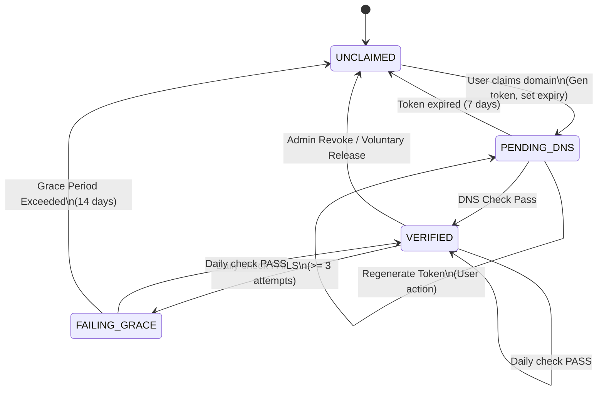

Status: DRAFT
Authors: @psankar
Dependencies: None

# Employer Domain Verification Specification

This document defines the authoritative state machine and workflows for verifying Employer identity via DNS.

## 1. Core Principles & Policies

1.  **Root Domain Exclusivity**: Identity is tied to the **Root Domain** (e.g., `acme.com`). Subdomains (e.g., `jobs.acme.com`) are **invalid** for employer identity.
    *   *Rationale*: Prevents fragmentation of a single company into multiple employer accounts.
2.  **Single Initial Claimant**: During onboarding, a domain can have only **one** pending claim.
    *   Once verified, the initial user becomes the first Admin. They can invite others.
    *   Until verification, no other user can claim this domain.
3.  **Proof of Ownership**: Verification is done strictly via DNS `TXT` records.
    *   HTML tags or file uploads are NOT supported (security risk for some platforms).
    *   Token entropy must be sufficient to prevent guessing (128+ bits).

## 2. Entity Definitions

### 2.1 Domain Asset
The unique identifier for an employer.
*   **Attributes**:
    *   `hostname` (PK): Standardized lowercase, punycode-if-necessary root domain.
    *   `status`: Current lifecycle state.
    *   `verification_token`: The active secret expected in DNS.
    *   `token_expires_at`: Timestamp when the current token is invalidated.
    *   `last_verified_at`: Timestamp of last successful DNS check.
    *   `consecutive_failures`: Counter for backoff logic.
    *   `claimed_by_user_id`: Reference to the user attempting verification (cleared after success).

## 3. The Lifecycle State Machine

The domain transitions through these exclusive states.

| State | Description | Time Limit | Allowed Actions |
| :--- | :--- | :--- | :--- |
| **UNCLAIMED** | Available for any generic user with a matching email address to claim. | N/A | `claim_domain(domain)` |
| **PENDING_DNS** | Token generated. Waiting for user to add TXT record. Other users are blocked. | 7 Days | `verify_now()`, `regenerate_token()` |
| **VERIFIED** | Identity confirmed. Employer account is active. | Indefinite | `add_admin()`, `post_job()` |
| **FAILING_GRACE**| DNS record is missing/wrong. Employer is NOT punished yet, but warned. | 14 Days | `verify_now()` (restore) |

**Note**: "Suspended" is an *Account Level* status, often triggered if `FAILING_GRACE` expires. The *Domain* strictly tracks DNS status.

## 4. Key Workflows

### 4.1 Onboarding & Claiming
**Actor**: New User (e.g., `alice@acme.com`)
1.  **Validation**:
    *   Extract root domain: `acme.com`.
    *   Check if `acme.com` is strictly a public suffix (e.g., `co.uk` is forbidden).
    *   Check if email matches domain (`@acme.com` matches `acme.com`).
2.  **Lock Check**:
    *   If `VERIFIED`: Reject. "Organization already exists. Ask admin for invite."
    *   If `PENDING_DNS`: Reject. "Claim in progress by `al***@acme.com`."
    *   If `FAILING_GRACE`: Reject. "Organization exists but is in maintenance."
3.  **Action**:
    *   Transition `UNCLAIMED` -> `PENDING_DNS`.
    *   Generate `verification_token` (e.g., `vdv_a1b2...`).
    *   Set `token_expires_at = NOW + 7 DAYS`.
4.  **Output**: Show DNS instructions.

### 4.2 Verification (Manual & Automated)
**Trigger**: User clicks "Verify" OR Cron Job runs.

1.  **DNS Lookup**: Query `TXT` records for `_vetchium-verify.<domain>`.
2.  **Match**:
    *   **Success**:
        *   Transition -> `VERIFIED`.
        *   Clear `token_expires_at`.
        *   Reset `consecutive_failures = 0`.
        *   (First Valid): Promote `claimed_by_user_id` to Employer Admin.
        *   **Schedule Next Check**: NOW + 60 DAYS.
    *   **Failure**:
        *   If `PENDING_DNS`: Do nothing. (Wait for user).
        *   If `VERIFIED`: Increment `consecutive_failures`.
            *   If `failures >= 3` -> Transition to `FAILING_GRACE`.
            *   Notify Admins: "Domain verification failing."

### 4.3 The "Failing Grace" Period
**Context**: Companies sometimes mess up DNS migrations. We don't want to kill their account immediately.

*   **Frequency**: Automated checks run every **60 days** for verified domains.
*   **Duration**: 14 Days (once failing).
*   **Behavior**:
    *   Employer can still log in.
    *   **Traffic**: Users visiting jobs via the failing domain are still allowed access during grace.
    *   **Cron**: Checks daily during grace.
        *   **Pass**: Immediate restore to `VERIFIED`. Notify "You're back online". Next check in 60 days.
        *   **Expiry**: If Day 15 is reached without fix:
            *   Transition Domain -> `UNCLAIMED`.
            *   **Trigger Deactivation Check** (See 4.4 Multi-Domain Logic).

### 4.4 Multi-Domain Handling & account Safety
**Principle**: An Employer Account is only deactivated if **ALL** its verified domains are lost.

1.  **Primary Domain Logic**:
    *   Every Employer has one `primary_domain`.
    *   If `primary_domain` enters `FAILING_GRACE`, no immediate change to primary status.
    *   If `primary_domain` stays failing and expires (becomes `UNCLAIMED`):
        *   **Check**: Does Employer have other `VERIFIED` domains?
        *   **Yes**: Automatically promote the oldest `VERIFIED` domain to `primary_domain`. Notify Admins.
        *   **No**: Employer Account transitions to `DEACTIVATED`. All jobs unlisted.

2.  **Grace Period Access**:
    *   Even if a domain is `FAILING_GRACE`, it is considered "trusted enough" for 14 days.
    *   Legacy links to jobs on the failing domain MUST continue to work until the domain is fully `UNCLAIMED`.

## 5. Security & Edge Cases

### 5.1 Subdomain Attacks
*   User `bob@student.university.edu` tries to claim `university.edu`.
*   **Fix**: Email must strictly match the root domain being claimed.
*   User `bob@university.edu` tries to claim `cs.university.edu`.
*   **Fix**: System rejects subdomains. Must claim `university.edu`.

### 5.2 Token Guessing
*   Token must be a cryptographically secure random string (CSPRNG), not based on timestamp or user ID.
*   Format: `vdv_[base62_24_chars]` (e.g., `vdv_8s9d8s9d8s9d8s9d8s9d8s9d`).

### 5.3 DNS Caching & Flaky Networks
*   **Problem**: DNS updates take time (TTL).
*   **Solution**:
    *   User-triggered "Verify Now" ignores internal cache if possible.
    *   Cron job requires **3 consecutive daily failures** before moving verified domain to risk state. This filters out 48h propagation glitches or provider outages.

### 5.4 Public Suffix List (PSL)
*   User `hacker@gmail.com` tries to claim `gmail.com`.
*   **Fix**: `gmail.com` is on the **Blocklist** of major providers.
*   User `me@co.uk` tries to claim `co.uk`.
*   **Fix**: Use the Public Suffix List library. `co.uk` is an effective TLD, not a domain. Result: Error.

## 6. Implementation Notes for Frontend
*   **Masking**: When showing "Claimed by `al***@acme.com`", ensure the mask is irreversible.
*   **Copy-Paste**: Provide a "Copy" button for the TXT value. Spaces in DNS records often cause failures.
