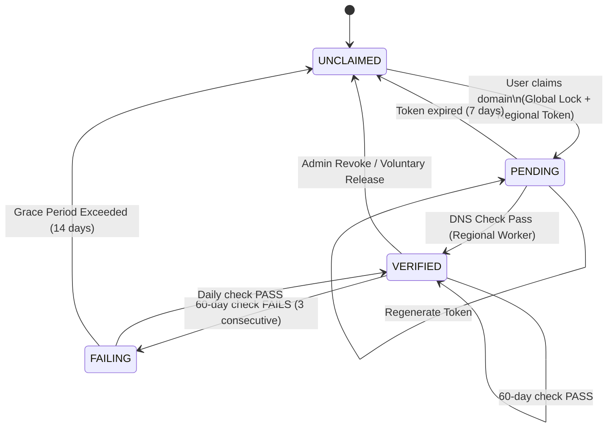

Status: DRAFT
Authors: @psankar
Dependencies: None

# Employer Domain Verification Specification

This document defines the authoritative state machine and workflows for verifying Employer identity via DNS within Vetchium's distributed global architecture.

## 1. Acceptance Criteria

- **Global Uniqueness**: An Employer Domain (e.g., `example.com`) must be unique across the entire platform, regardless of region.
- **Regional Sovereignty**: Detailed verification logs and employer profile data must reside in the region where the employer signed up.
- **Zero-Downtime Verification**: DNS checks must be performed by regional workers but synchronized globally to prevent race conditions.
- **Strict Root Domains**: Only root domains (e.g., `example.com`) are allowed. Subdomains are invalid.

## 2. Distributed Architecture Design

Vetchium uses a **Global Database** for routing/uniqueness and **Regional Databases** for bulk data.

### 2.1 Architecture Decision: Global vs Regional Storage

We evaluated two models for storing domain verification data.

| Strategy        | **Model A: Global Master**                                                                                                              | **Model B: Regional Master (Selected)**                                                                                                               |
| :-------------- | :-------------------------------------------------------------------------------------------------------------------------------------- | :---------------------------------------------------------------------------------------------------------------------------------------------------- |
| **Description** | All domain records (`token`, `status`, `logs`) live in Global DB. Regional DBs query Global for auth.                                   | Global DB acts as a "Router" (Index). Regional DB owns the `token` and `lifecycle`.                                                                   |
| **Pros**        | Simplest uniqueness guarantees. No synchronization needed for "Claim" logic.                                                            | **Scalability**: High-frequency writes (cron jobs updating `last_checked`) happen locally. **Residency**: Detailed audit logs never leave the region. |
| **Cons**        | **Bottleneck**: Every DNS check writes to Global. **Latency**: Regional API servers must round-trip to Global for every reliable check. | **Complexity**: Requires distributed transactions (SAGA pattern) during the initial Claim phase.                                                      |

**Decision**: We use **Model B**. The high frequency of "DNS Verification Cron Jobs" (daily/monthly for millions of domains) makes a Global Write Master unscalable. Global DB should only store slowly-changing routing data.

### 2.2 Data Split Strategy

| Logic Layer            | Database        | Table                     | Responsibility                                                                                               |
| :--------------------- | :-------------- | :------------------------ | :----------------------------------------------------------------------------------------------------------- |
| **Routing / Identity** | **Global DB**   | `global_employer_domains` | Ensures `example.com` is claimed by ONLY ONE region/employer. Stores `verification_status` for fast routing. |
| **Operational Data**   | **Regional DB** | `employer_domains`        | Stores tokens, full audit logs, and cron-job state (`consecutive_failures`).                                 |

### 2.3 Global vs Regional Synchronization

1.  **Claim (Write)**:
    - Happen as a distributed transaction.
    - **Lock in Global**: Insert `domain='example.com', region='USA1', status='PENDING'`. (Fails if exists).
    - **Write in Regional**: Insert into `employer_domains` with generated token.
    - _Compensating Transaction_: If Regional write fails, delete Global lock.

2.  **Verify (Read/Update)**:
    - Regional Cron Job checks DNS.
    - On Status Change (`VERIFIED`, `FAILING`): Update Regional DB -> Update Global DB.

## 3. Entity Definitions

### 3.1 Domain Asset (Concept)

The unique identifier for an employer.

### 3.2 Constants

| Constant                     | Value | Description                                       |
| :--------------------------- | :---- | :------------------------------------------------ |
| `TOKEN_EXPIRY_DAYS`          | 7     | Days before pending verification token expires    |
| `VERIFICATION_INTERVAL_DAYS` | 60    | Days between routine DNS verification checks      |
| `GRACE_PERIOD_DAYS`          | 14    | Days of failing checks before domain is unclaimed |
| `MAX_CONSECUTIVE_FAILURES`   | 3     | Number of failures before entering grace period   |

### 3.3 Domain Verification Status Enum

A single unified enum used across Global DB, Regional DB, and API responses:

| Status     | Description                               |
| :--------- | :---------------------------------------- |
| `PENDING`  | Domain claimed, awaiting DNS verification |
| `VERIFIED` | DNS verification successful               |
| `FAILING`  | DNS verification failed, in grace period  |

Note: `UNCLAIMED` is not a status stored in the database - it means no record exists for that domain.

### 3.4 Database Schema

#### Global Database

```dbml
Table global_employer_domains {
  domain text [pk, note: "lowercase, punycode"]
  region region [note: "Enum: IND1, USA1, DEU1"]
  employer_id uuid [ref: > global_employers.id]
  status domain_verification_status [note: "PENDING, VERIFIED, FAILING"]
  created_at timestamp
}
```

#### Regional Database

```dbml
Table employer_domains {
  domain text [pk]
  employer_id uuid [ref: > employers.id]
  verification_token text [note: "Secret expected in DNS"]
  token_expires_at timestamp
  last_verified_at timestamp
  consecutive_failures int
  status domain_verification_status
}
```

## 4. The Lifecycle State Machine

The domain transitions through these exclusive states.



## 5. Key Workflows

### 5.1 Onboarding & Claiming

**Actor**: New User in Region `USA1`.

1.  **Validation**: Check format (Root domain only).
2.  **Global Lock (Critical)**:
    - Attempt `INSERT INTO global_employer_domains (domain, region, status) VALUES ('example.com', 'USA1', 'PENDING')`.
    - **IF ERROR (Duplicate)**: Return "Domain already claimed".
3.  **Regional Creation**:
    - Generate `token`.
    - `INSERT INTO employer_domains` in `USA1` DB.
4.  **Output**: Show DNS instructions.

### 5.2 Verification (Manual & Automated)

**Trigger**: User clicks "Verify" OR Regional Cron Job runs.

1.  **DNS Lookup**: Query `TXT` records for `_vetchium-verify.<domain>`.
2.  **Match Success**:
    - **Regional**: Update `status='VERIFIED'`, `next_check = NOW + 60 days`.
    - **Global**: Update `status='VERIFIED'` (Allows cross-region visibility).
3.  **Match Failure**:
    - **Regional**: Increment `consecutive_failures`.
    - If `failures >= 3` -> Transition to `FAILING`.
    - **Global**: Update `status='FAILING'`.

## 6. Implementation Notes

### 6.1 Frontend

- **Masking**: When showing "Claimed by `al***@example.com`", ensure the mask is irreversible.
- **Copy-Paste**: Provide a "Copy" button for the TXT value.

### 6.2 API Definition via TypeSpec

NOTE: These models represent the Regional API, as the Global API is internal-only for this feature.

See [specs/typespec/org/org-domains.tsp](../typespec/org/org-domains.tsp) for the complete TypeSpec definitions.

#### API Endpoints Summary

| Endpoint                      | Auth         | Description                              |
| :---------------------------- | :----------- | :--------------------------------------- |
| `POST /employer/init-signup`       | None         | Send magic link to user's email          |
| `POST /employer/complete-signup`   | Signup Token | Complete signup after email verification |
| `POST /employer/claim-domain`      | Session      | Claim a domain for verification          |
| `POST /employer/verify-domain`     | Session      | Trigger manual DNS verification          |
| `POST /employer/get-domain-status` | Session      | Get current domain verification status   |

#### HTTP Response Codes

| Scenario               | Status Code | Description                                      |
| :--------------------- | :---------- | :----------------------------------------------- |
| Success                | 200/201     | Request successful                               |
| Validation Error       | 400         | Invalid request body or field validation failed  |
| Invalid Token          | 401         | Expired or invalid signup/session token          |
| Domain Already Claimed | 409         | Domain is already claimed by another employer    |
| Invalid State          | 422         | Account or domain in invalid state for operation |
| Server Error           | 500         | Internal server error                            |
