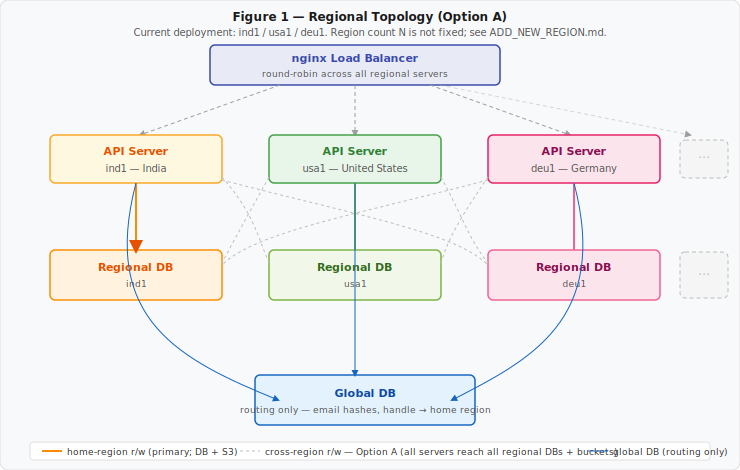
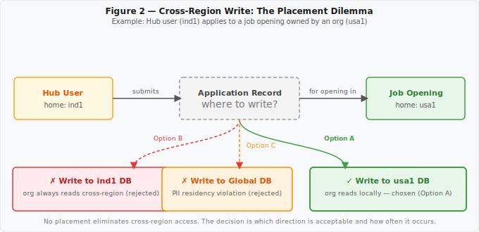
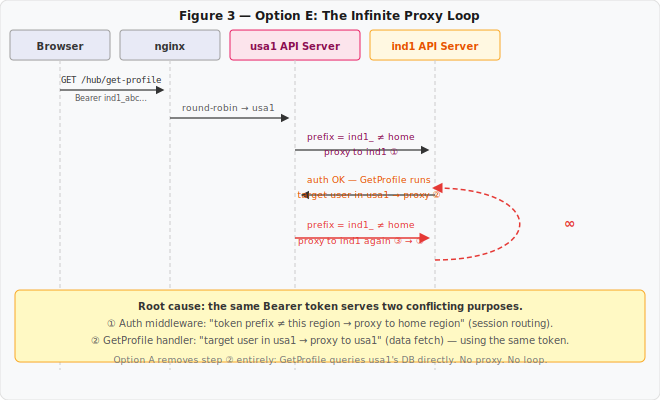

# ADR-001: Multi-Region Distributed Write Architecture

## Abstract

Vetchium distributes its data across N regional PostgreSQL databases to achieve data residency,
regulatory compliance, and low read latency. When entities homed in different regions interact —
a professional in `ind1` applying to a job posted by an org in `usa1`, for example — no placement
of the resulting record avoids cross-region data access entirely. This document records the
problem, five architectural options evaluated against a fixed set of constraints, the reason each
alternative was rejected, and the risk mitigations in place for the chosen design: **full
cross-region read-write database access from all regional API servers**.

---

## 1. System Context

### 1.1 Infrastructure

| Component | Cardinality | Role |
|---|---|---|
| Global PostgreSQL DB | 1 | Identity routing: email hashes, handle → home-region mapping. No PII. |
| Regional PostgreSQL DB | N (currently `ind1`, `usa1`, `deu1`) | All PII, credentials, mutable entity state. Each regional DB is authoritative for entities homed there. |
| Regional API Server | N | HTTP request handlers. One per region. |
| nginx Load Balancer | 1 | Distributes HTTP traffic across all regional API servers (round-robin). |
| Object Storage (S3-compatible) | 1 | Profile pictures and file uploads. |

New regions are added by following [ADD_NEW_REGION.md](../ADD_NEW_REGION.md). Every new region
adds one regional DB and one regional API server; the architecture described here applies
identically to each.



### 1.2 Entity Ownership

Every entity has a *home region* set at creation and never changed:

| Entity | Home region determined by |
|---|---|
| Hub user (professional) | Geolocation or preference at signup |
| Organisation | Geolocation or preference at signup |
| Job opening | Inherits from the creating organisation |

All mutable state for an entity — profile, credentials, settings, role assignments — is written to
and read from its home regional database.

### 1.3 Session Token Format

Session tokens carry a region prefix (`ind1_`, `usa1_`, `deu1_`, …). The auth middleware on each
regional API server uses this prefix to identify the user's home region and validate that the
request is executing against the correct data.

---

## 2. The Problem

### 2.1 Cross-Region Interaction

Consider the canonical cross-region interaction: a Hub user homed in `ind1` applies to a job
opening posted by an organisation homed in `usa1`.

The resulting application record has two primary stakeholders:

- **The user** (`ind1`): must write the record; must read their own application history.
- **The organisation** (`usa1`): must read all applications for their opening.

This creates a placement dilemma with no lossless option:



| Placement | User writes? | Org reads? | Implication |
|---|---|---|---|
| User's regional DB | ✓ direct | ✗ cross-region read | Org always reads cross-region for every applicant list query |
| Opening's regional DB | ✗ cross-region write | ✓ direct | User's server writes cross-region once at submission |
| Both DBs | ✓ | ✓ | Dual-write; distributed consistency problem; compensating transactions required |
| Global DB | requires schema change | requires schema change | Global DB becomes PII store; data residency violation; see §4.2 |

**There is no placement that avoids cross-region data access entirely.** The problem reduces to:
which direction of cross-region access is acceptable (read, write, or both), and what mechanism
implements it?

### 2.2 Generalisation

The placement dilemma applies to every cross-region interaction:

- Hub user `A` (region X) ↔ Hub user `B` (region Y): connection request, direct message, endorsement
- Hub user `A` (region X) → Org `B` (region Y): application, saved job, follow
- Any future entity-to-entity relationship crossing a region boundary

Any architecture that avoids cross-region writes entirely must either (a) prohibit cross-region
interactions, or (b) replicate all entity data to all regions — neither of which is acceptable.

---

## 3. Design Constraints

The following constraints were established prior to evaluating options. Options that violate any
constraint are rejected regardless of other merits.

| # | Constraint | Rationale |
|---|---|---|
| C1 | No PII in the global DB | The global DB is a thin routing table. Expanding its scope creates a write bottleneck and violates data residency requirements (e.g., GDPR). |
| C2 | No managed distributed databases | Spanner, CockroachDB, PlanetScale introduce vendor lock-in or operational complexity disproportionate to pre-launch scale. |
| C3 | Synchronous write confirmation for user-facing mutations | Submitting an application, accepting a connection, sending a message must return a durable success or explicit failure before the HTTP response returns. Eventual consistency is not acceptable on these paths. |
| C4 | No inter-service credential management | Service tokens (JWT or otherwise) for server-to-server auth introduce a new credential class with distribution, rotation, and revocation complexity not warranted at current scale. |

---

## 4. Options Evaluated

### 4.1 Option A — Full Cross-Region Read-Write *(Chosen)*

Every regional API server holds read-write PostgreSQL connection pools to all N regional
databases. Application-layer logic determines which pool to use for each operation:

- **Entity writes** → entity's home region DB.
- **Interaction writes** → the semantically most appropriate region's DB (placement policy in §7).
- **Reads** → whichever DB holds the authoritative record.

The pool selection is explicit in every sqlc query call. There is no implicit or automatic routing.

---

### 4.2 Option B — Global DB as Interaction Layer *(Rejected)*

Move cross-entity interaction tables (applications, connections, messages) to the global DB.
Regional DBs store only entity-local state. No cross-region writes to regional DBs.

**Rejection rationale:**

**R-B1: Bottleneck shift, not elimination.** The global DB is a single logical instance with no
regional redundancy. Moving high-volume interaction writes to it makes it the platform's primary
write bottleneck. Interaction volume is O(users × activity), growing faster than identity routing
volume which is O(users).

**R-B2: Data residency violation.** The global DB's defined invariant is *no PII*. Job
applications contain resume text, cover letters, and salary expectations. Storing them globally
violates data residency and privacy regulatory requirements: a German user's application data
cannot legally reside in a US-hosted global DB (GDPR Art. 44–46).

**R-B3: Schema migration cost.** All existing interaction-adjacent schemas would require migration.
While the system is pre-launch (no production data to move), this is significant churn.

**R-B4: Deferred bottleneck.** If the global DB later requires sharding, the same placement
problem reappears one level up with a harder-to-change schema.

---

### 4.3 Option C — Distributed SQL *(Rejected)*

Adopt CockroachDB, YugabyteDB, or Google Spanner. The database layer handles regional placement,
replication, and cross-region writes transparently. The application uses a single connection
endpoint.

**Rejection rationale:**

**R-C1: Operational complexity disproportionate to scale.** Cluster management, zone
configuration, and geo-partitioning require dedicated infrastructure expertise not warranted
pre-launch.

**R-C2: Vendor lock-in.** Spanner requires GCP. CockroachDB and YugabyteDB introduce non-standard
SQL extensions. Migration away from standard PostgreSQL is a multi-month effort.

**R-C3: Cost.** Distributed SQL licensing and hosting at pre-launch scale cannot be justified.

Note: Option C is the correct long-term migration target if Option A's conventions become
unmanageable at scale. The migration path is documented in §9.

---

### 4.4 Option D — Asynchronous Event-Driven Writes *(Rejected)*

Cross-region writes are enqueued as events (Kafka, SQS, or PostgreSQL LISTEN/NOTIFY). The target
region's worker consumes the event and writes to its DB. Reads use local replicas updated via CDC.

**Rejection rationale:**

**R-D1: Violates constraint C3.** A user submitting a job application must receive a durable
confirmation or an explicit failure before the HTTP response returns. An enqueued event cannot
provide this guarantee synchronously.

**R-D2: Distributed saga complexity.** If the consumer fails after the producer commits, the
system enters an inconsistent state. Compensating transactions (sagas) are significantly more
complex to implement, test, and operate than a direct DB write within a transaction.

**R-D3: Infrastructure addition.** Kafka or equivalent adds an operational dependency with its
own availability, partitioning, and schema evolution requirements.

---

### 4.5 Option E — Inter-Regional HTTP Proxy with Service Tokens *(Rejected)*

The receiving regional API server forwards mutation requests to the target region's API server,
authenticated with a service token that bypasses user auth. The target server writes to its own
regional DB.

**Rejection rationale:**

**R-E1: Violates constraint C4.** Service tokens are a new credential class: generated,
distributed to all regional servers, validated at every cross-region endpoint, rotated on
compromise.

**R-E2: API server / DB health coupling.** If region Y's API server crashes, region X cannot
write an interaction record — even though region Y's DB is healthy and available. Option A writes
directly to the DB, decoupled from the target API server's availability.

**R-E3: Endpoint proliferation.** Every new cross-region interaction requires the target endpoint
to accept both user tokens and service tokens, doubling the authentication logic surface per
endpoint.

**R-E4: Infinite routing loop.** The HTTP proxy approach produced an unrecoverable routing cycle
during development. This is documented in full in §5; the cycle is structural, not incidental,
and any fix adds complexity that negates the approach's stated benefit.

---

## 5. The Proxy Loop: Empirical Rejection of Option E

This section documents the specific failure that emerged during development with the HTTP proxy
approach, to justify its rejection empirically rather than theoretically.



**Preconditions:**
- nginx round-robins across all N regional API servers (no session affinity).
- Session token prefix encodes home region (e.g., `ind1_abc123`).
- Auth middleware rule: if a request arrives on a non-home server, proxy it to the home server.
- `GetProfile` handler rule: if the target user is in a different region, proxy to that region's server.

**Execution trace** (user homed in `ind1` views the profile of a `usa1` user):

```
1. Browser → nginx → usa1 server   [round-robin, arbitrary landing]
2. usa1 auth: token prefix = ind1_ → proxy full request to ind1 server
3. ind1 auth: token prefix = ind1_ → home region confirmed, execute handler
4. GetProfile on ind1: target user is usa1 → proxy request to usa1 server (original Bearer token)
5. usa1 auth: token prefix = ind1_ → proxy full request to ind1 server
6. → goto 3                         [infinite loop]
```

The loop is structural. The same Bearer token simultaneously signals "route this session to ind1"
(steps 2, 5) and "fetch this profile from usa1" (step 4). Any resolution within Option E requires
either (a) a hop counter, (b) a "do-not-proxy" header, or (c) a separate credential for
data-fetch proxying — each adding complexity that negates the approach's stated simplicity.

Option A eliminates step 4 entirely. `GetProfile` on `ind1`'s server reads `usa1`'s DB directly
via its cross-region connection pool. No proxy. No loop.

---

## 6. Decision

**Option A is adopted**: all regional API servers hold read-write connection pools to all N
regional databases. The correct target database for any write is determined by application-layer
logic and documented in the placement policy below.

---

## 7. Interaction Record Placement Policy

Every PR introducing a new cross-region write must cite the applicable rule from this table or
propose an amendment with rationale.

| Interaction | Write target | Rationale |
|---|---|---|
| Job application | Opening's regional DB | The organisation reviews applicants; their server reads locally. The user writes once; the org reads many times. Optimise for read frequency. |
| Hub user ↔ Hub user connection | Both users' regional DBs (symmetric) | The connection is undirected. Each user's server must confirm connection status locally. A single-copy model would always force one party to read cross-region. |
| Direct message | Recipient's regional DB | The recipient reads messages; the sender receives a synchronous write confirmation and no further reads from this record. |
| Endorsement | Endorsed user's regional DB | Endorsements are displayed on the endorsed user's profile, which their home server renders. |
| Job bookmark / saved job | User's regional DB | Only the bookmarking user reads this record. |

---

## 8. Consequences

### 8.1 Positive

**No new infrastructure.** No message broker, no distributed SQL cluster, no service credential
system is required beyond what already exists.

**API server / DB health decoupling.** If region Y's API server crashes, region X can still write
to region Y's DB. Only a DB-level failure or network partition between region X's server and
region Y's DB affects cross-region write availability.

**Compile-time pool visibility.** sqlc generates a separate typed struct of query functions per
database. A cross-region write is explicit, named, and visible in PR diffs. There is no ORM
routing that silently targets the wrong DB.

**Transparent migration path to Option C.** Moving to a distributed SQL database at scale
requires removing the multi-pool connection logic and changing connection strings. No
application-layer redesign is needed because the data model remains relational and query semantics
are unchanged.

### 8.2 Negative

**Convention-enforced write correctness.** Choosing the wrong DB pool for a write is not caught by
infrastructure. It requires code review and tests that verify which pool was targeted. This is the
primary risk of Option A.

**Connection count scales with N.** Each regional API server maintains pools to N regional DBs
plus the global DB. At high concurrency this is (N+1)× the connections of a single-region setup.
PostgreSQL's `max_connections` limit must be managed; pgBouncer should be deployed before
connection count becomes a constraint.

**Cross-region connectivity monitoring.** A network partition between region X's server and region
Y's DB makes region X unable to serve region Y–owned entities. Monitoring must cover all
server-to-DB pairs as distinct health signals, not only local DB connectivity.

---

## 9. Risk Register

| Risk | Likelihood | Impact | Mitigation |
|---|---|---|---|
| Handler writes to wrong region's DB | Low | High | sqlc forces explicit pool selection per query call; PR review checklist requires cross-region write audit against §7 |
| Cross-region DB network partition | Medium | Medium | 503 returned for affected cross-region operations; no data corruption; the partition is stateless and resolves on reconnect |
| DB connection pool exhaustion | Low at current scale | High | pgBouncer in front of regional DBs; connection count monitored per server-to-DB pair |
| §7 placement conventions erode over time | Medium | Medium | This document is the policy reference; a future lint rule can enforce that cross-region pool usage requires a comment citing the applicable §7 rule |

---

## 10. Migration Path

If Option A's code-convention-based isolation becomes unmanageable at scale, the recommended
progression is:

**Step 1 — Near-term lint enforcement.** Introduce a Go annotation (e.g., a `//nolint:crossregion`
marker or a custom static analysis pass) that must be present on any sqlc call targeting a
non-home DB pool. This converts the code review convention into a CI-enforced check without any
schema or infrastructure changes.

**Step 2 — Long-term: Distributed SQL.** Migrate to CockroachDB or YugabyteDB with
geo-partitioning. The multi-pool connection logic in the API server is removed entirely; the DB
handles placement transparently. This is the correct target architecture at the scale where Option
A's operational overhead exceeds the cost of the migration.

---

*This document is the authoritative record for Vetchium's multi-region data access architecture.
Changes to the design require a pull request updating this document with revised rationale. The
placement policy in §7 is the operational contract; any new cross-region write that does not fit
an existing rule must amend §7 before the implementing PR is merged.*
